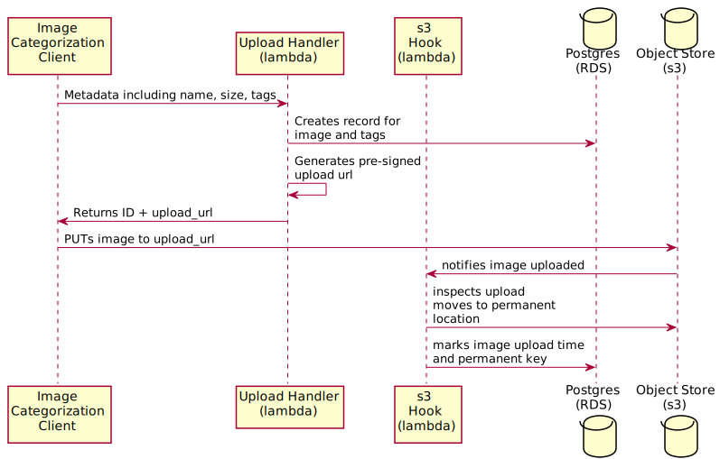

# API Design

The proposed API design is available in these formats:

- as an [OpenAPI 3.0.0 spec][1] for use in [compatible editors][2]
- as a [generated Markdown file][3] for human consumption

The API is protected by a Bearer Token mechanism, whereby the token is an `access` token issued by Amazon Cognito User Pools.

If you wish to edit the generated file, install [widdershins](https://github.com/Mermade/widdershins) and run `make docs` from the repo root.

### Uploading Images

There are two ways to upload an image as described by the documentation:

- a single shot POST to `/v1/upload` endpoint that will accept payloads up to 3.96 MB (limited by API Gateway + Lambda)

- a POST to `/v1/images` followed by a PUT to a presigned s3 url:

### Managing Images and Tags

The API docs describe usual CRUD endpoints to manage Tags and Images independently of each other.

An Image will only have a `url` and upload date if it actually present.

The Image browsing view (`/v1/images`) is paging and allows you to specify start/end timestamps, paging offsets and limits, and to exclude images which are not present.

### Searching

There is a generic search endpoint at `/v1/search/images` which allows you to search for images by exact or matching tags. There is a performance hit to using the 'matching' function because it does a text search and supports the `%` wildcard (using `ILIKE` or similar abstraction).

The Search endpoint (`/v1/images`) is paging and allows you to specify start/end timestamps, paging offsets and limits, and to exclude images which are not present.

---

[1]: ./openapi/tagged-image-manager.yml
[2]: https://marketplace.visualstudio.com/items?itemName=42Crunch.vscode-openapi
[3]: ./openapi/generated-tagged-image-manager.md
